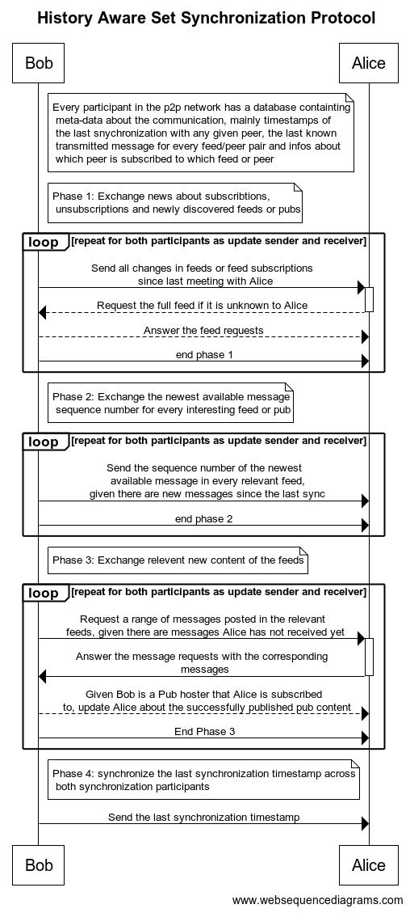
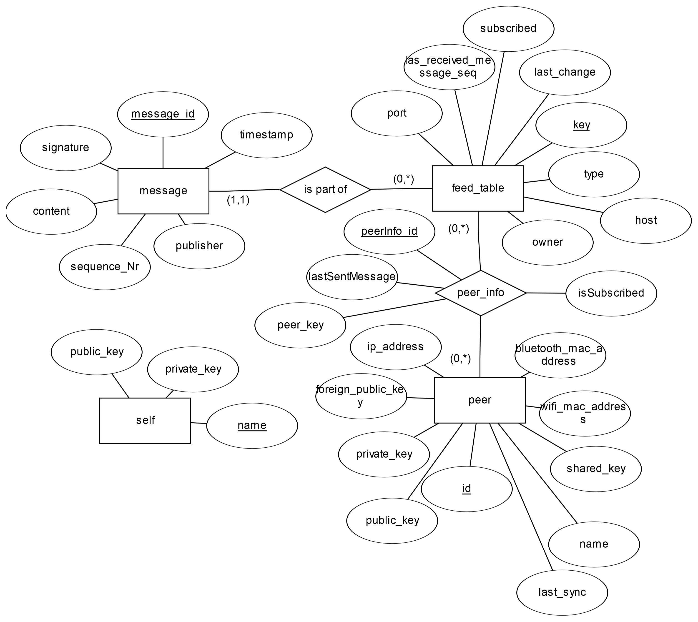

# History Aware Set Synchronization Protocol

Set synchronization is an important aspect in p2p networks, in an effort to optimize communication
between peers by reducing the exchanged packages we designed and implemented a history aware set
synchronization protocol, making exchanges of already known content obsolete.

This work is done as part of a bachelors thesis, and the implementation is based on SDaTaDirect,
an app designed to securely exchange data in a p2p environment, written by Gowthaman Gobalasingam.

The protocol is divided in 4 phases and utilizes metadata about the communication history between
any given pair of peers and the relevant feeds for a particular synchronization pair. A detailed description
of the protocol can be seen here:

Furthermore, the database design produced while implementing the protocol is showcased here:

