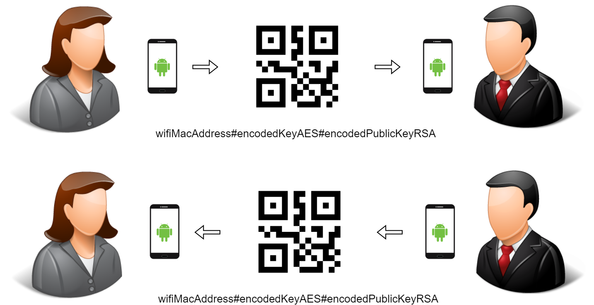
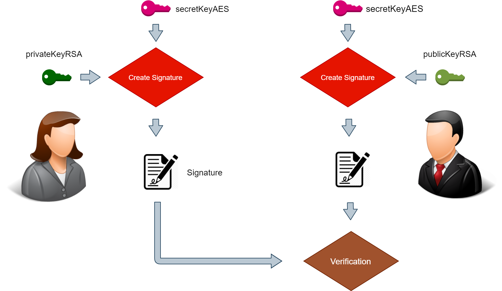
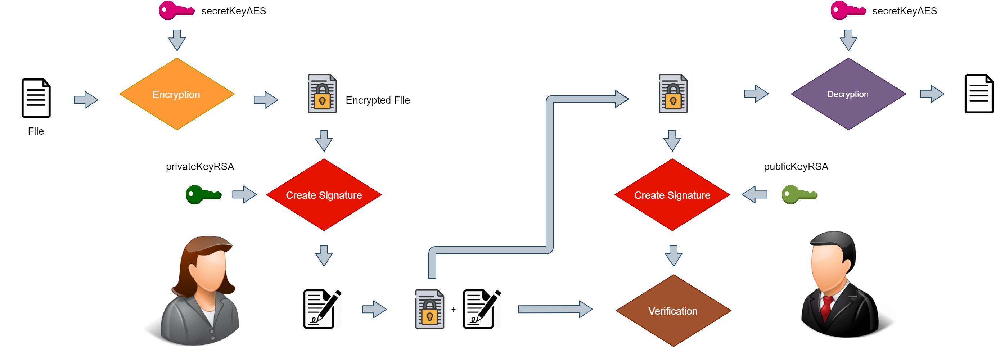

# SDaTaDirect

SDaTaDirect stands for **S**ecured **Da**ta **T**r**a**nsfer via WiFi-**Direct**. This app was developed for a Bachelor's project work. 
The aim was to build a protocol for secured data sharing. We used here first the AES algorithm for encryption and decryption and
RSA together with SHA-256 for the signature.

The protocol is roughly structured in three phases as follows:

1. Secured pairing via QR-Code (only once)
2. Initiate WiFi-Direct connection setup via Bluetooth
3. Data transfer via WiFi-Direct

## Phase 1:
In the pairing phase, Alice and Bob exchange some information via QR-Code. After phase 1 the both will use the shared key 
generated by the one who accepts the incoming connection in phase 2.

## Phase 2:
Authentication via the digest of the shared key. 

## Phase 3:
Secured data transfer.

